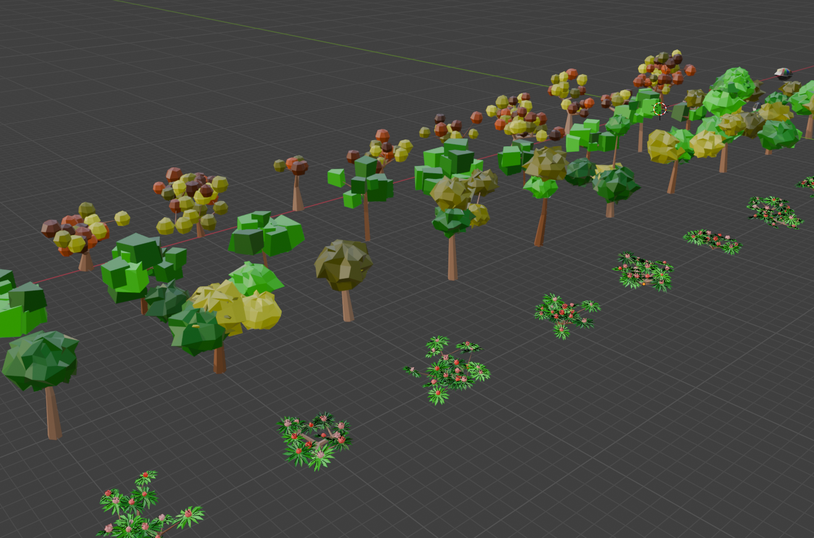
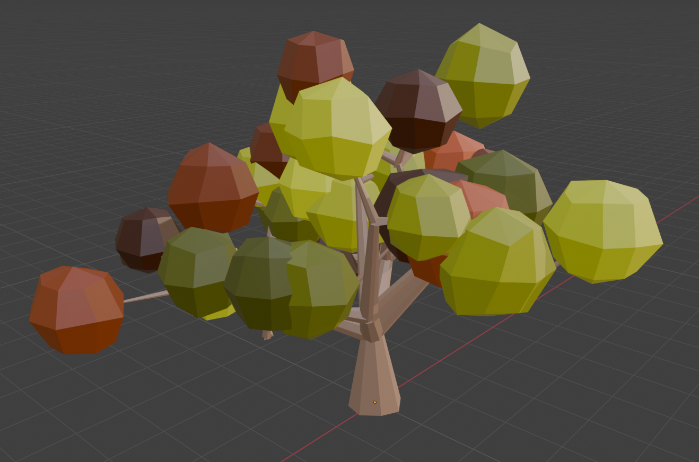
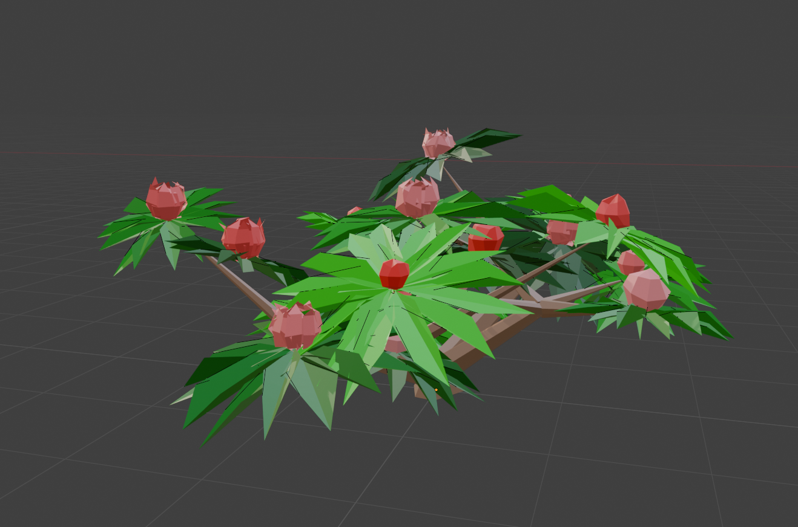

# Blender Low-Poly Tree Generator

Python scripts for Blender to help create low-poly stylized trees.

Here some examples (included in TreeExamples.py).

## Demo video

## Use

The file `TreeGeneratorPython.blend` has a **Scripting External** workspace. Running the script will regenerate all example trees. **Note**: The script deletes any previously generated objects with the same name.

There are many, many Python and Geometry Nodes examples of tree generators for Blender available. Many of them will suit your project better, but not mine.

## Description

The generator will create an trunk and tree branches using Blender curves, with variable radius at each part of the tree. The curve is then converted to a mesh, with resolution specified in the TrunkConfig object.

A Foliage mesh is then duplicated at each tree branch point (or multiple if you specify multiple FoliageConfig objects). All foliage meshes are combined into a single mesh.

For the trunk/branches and the foliage, you can specify UVRange objects (or multiple choices to be chosen randomly for foliage). The script will map all trunk and foliage mesh points to a random XY location in the UV map based on the UVRange object. This is how we get varied colours as shown in the examples. Using a gradient image is similar to how [Imphenzia](https://www.youtube.com/@Imphenzia) does colouring for his low-poly objects, which I think looks cool. All meshes share the same material image.

Along the way, meshes are distorted, scaled and rotated randomly, with variance under your control in the Config objects. `make_tree` takes a **seed** parameter, so you can reliably recreate the same trees for each run as you tweak the settings.

## Licence

This is MIT licensed, so have at it.